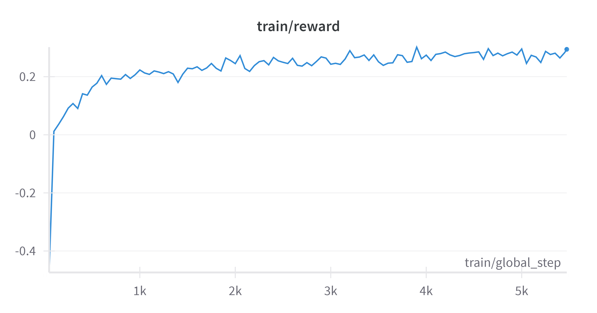
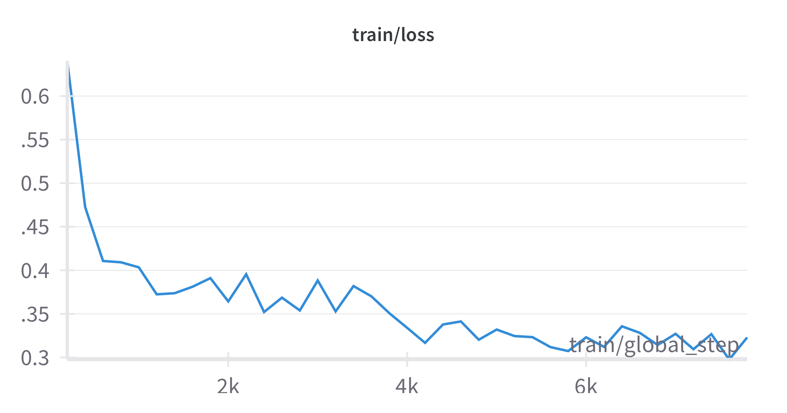

# EdNA: Educational Nimble Assistant


<div align="left">
   <em>Logo created with Microsoft Copilot</em>
</div>
<br><br>
This repository provides the code used to train EdNA collection of models, designed as part of the CS-552 MNLP course at EPFL. The models are trained based on Qwen3-0.6B-Base to perform well on STEM MCQAs and to identify humain preferences. <br>
EdNA collection consists of four models, each trained with a different approach:

- MCQA: Multiple Choice Question Answering
- Quantized-MCQA: Quantized Multiple Choice Question Answering
- RAG-MCQA: Retrieval-Augmented Generation Multiple Choice Question Answering
- DPO: Direct Preference Optimization

# Setup Instructions

To set up the environment for training the models, follow these steps:

1. Clone the repository:

   ```bash
   git clone
   ```

2. Install the requirements for the model you want to train:

   ```bash
   pip install -r <model>_requirements.txt
   ```

   Replace `<model>` with `dpo`, `mcqa`, `quantized`, or `rag`.

3. If you want to regenerate the training datasets add the M1 preferences json file to `data` folder and make sure to install the GPT Wrapper package as described [here](https://docs.google.com/document/d/1sNZUtlGNyfBfPgYY-nqW07b2jCB850LuX043HJTIJtg/edit?tab=t.0#heading=h.sf65u2rpbv0r).

4. In the root include `.env` file with the following content:

   ```bash
    GPT_TOKEN=<your GPT wrapper API key>
    HF_TOKEN=<your Huggingface Hub access token>
    HF_USERNAME=<your Huggingface Hub username>
    WANDB_USERNAME=<your WandB username>
    WANDB_API_KEY=<your WandB API key>
   ```

5. Run the training script for the model you want to train:

   ```bash
   bash code/train_<model>.sh
   ```

   Replace `<model>` with `dpo`, `mcqa`, `quantized`, or `rag`.

# Training time estimations

- DPO: Data generation ~20 hours , Training ~5 hours
- MCQA: SFT stage ~ 40 hours, GRPO stage ~ 70 hours
- Quantized-MCQA: ~ 15 minutes (Post Training Quantization)
- RAG-MCQA: RAFT training ~ 80 hours

# Expected training plots:

The GRPO training should look like this:

The DPO training should look like this:


# Evaluation

We provide different evaluation scripts for DPO and MCQ models. To get the same results we present in our report you can use `code/DPO_eval/custom_eval.py` that works on lighteval suite. For MCQ models, you can use `code/MCQ_eval/lighteval_test.py` fot the likelihood evaluation based on the lighteval suite. For our custom Output Correctness metric, you can use `code/MCQ_eval/output_correctness_test.py`.
